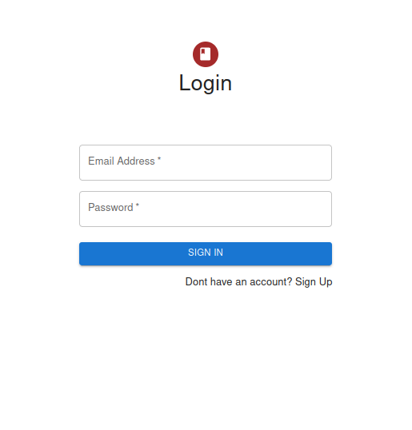
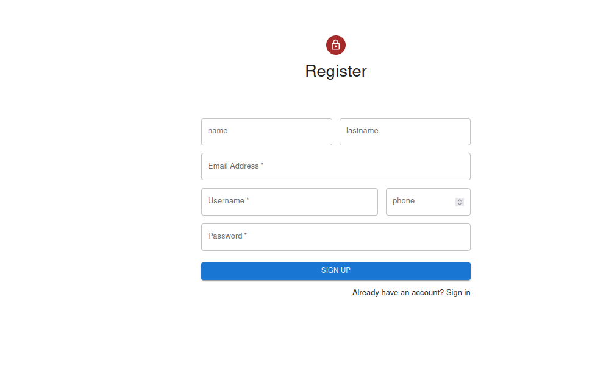

# LOGIN CON REACT, NODE Y MONGODB 

------

INFORMACION DEL PROYECTO

Es un login creado usando REACt, NODE Y MONGODB que permite la entrada solo a usuarios registrados y mediante una Cookie mantiene la session abierta para manejar los permisos a los que este usuario tiene acceso

## Tecnologías Utilizadas

- **MongoDB**: Base de datos NoSQL utilizada para almacenar información sobre libros, usuarios, préstamos y reservas.

- **Express.js**: Framework de backend que proporciona una API RESTful para la comunicación entre el cliente y la base de datos.

- **React**: Biblioteca de frontend para construir la interfaz de usuario interactiva y dinámica de la aplicación.

- **Node.js**: Entorno de tiempo de ejecución del lado del servidor para ejecutar el servidor web y la lógica de la aplicación.


​    

## Requisitos previos

- Node js instalado en tu maquina (Recomendada v18.16.0)

- Instalación de Node usando NVM para Linux => nvm install v18.16.0

- Instalación de Node usando NVM para Windows => https://github.com/coreybutler/nvm-windows

- Verifica si se instaló correctamente:

    ```bash
    node -v
    npm -v
    ```

- MongoDB instalado y configurado con las credenciales necesarias para conectarse a la base de datos.


 

## Instalación

**Repositorio a clonar:**

```bash
https://github.com/C-jimenez21/Login_React_Mongo
```

## Instrucciones

1. Descarga las dependencias y dependencias de desarrollo, usar: `npm i` o `npm update`

2. Una vez descargado nodejs y las dependencias crear el archivo **.env**, lo siguiente es la estructura que debe usar, tambien está en .env.example

```gherkin
MY_SERVER={"hostname":"127.10.10.10", "port":5050}
ATLAS_USER="USUARIO DE ATLAS"
ATLAS_PASSWORD="CLAVE DE ATLAS"
ATLAS_DB="Login-React"
JWT_SECRET="SECRETO DE JWT"
```

3.  iniciar el backend: `npm run dev`

El servidor debería iniciarse y estar listo para recibir solicitudes en la dirección   `http://127.10.10.10:5050/` (puedes cambiar el puerto en el archivo `.env` si lo deseas).

4. Establezca conección a atlas en mongo, luego dirijase al archivo **db.mongodb** Ubicado dentro la carpeta backend y ejecute el archivo (tenga en cuenta cambiar el cluster-code de acuerdo a su atlas)

`mongodb+srv://<user>:<password>@cluster0.<clusterCode>.mongodb.net/`


## **Paginas **

LOGIN / REGISTER

En estas paginas el usuario se puede loguear o registrarse como usuario



​	

------

## **Endpoints y Métodos**

A continuación, se describen los endpoints disponibles en la aplicación junto con sus respectivos métodos HTTP y formatos de datos requeridos.

------

## Endpoint: *Autenticación*

| CONSULTA                                                     | URL           | METHOD |
| ------------------------------------------------------------ | ------------- | ------ |
| Permite el registro de un nuevo usuario                            | /register     | POST    |
| Permite el logeo de un usuario existente | /login | POST    |
| Permite el cierre de session del usuario logeado                                    | /logout     | POST   |
| Trae los datos del cliente logeado                                           | /profile  | GET |


------

## Contacto

Si tienes alguna pregunta o comentario sobre esta aplicación, no dudes en ponerte en contacto con nosotros a través de  [cristianjj21@gmail.com](mailto:cristianjj21@gmail.com). ¡Esperamos que disfrutes usando nuestra aplicación!